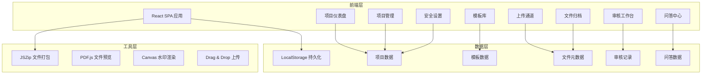
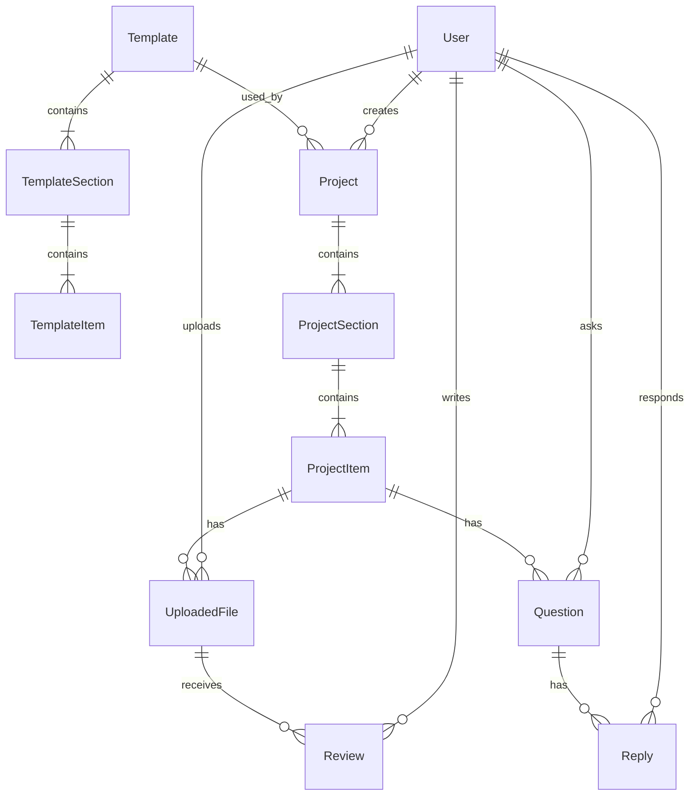

## 1. 架构设计



## 2. 技术说明

- 前端：React@18 + TailwindCSS@3 + Vite
- 初始化工具：Vite
- 后端：无（纯前端应用，使用 LocalStorage 模拟数据持久化）
- 数据库：无（使用 LocalStorage + 内存状态管理）
- 文件存储：浏览器内存 + IndexedDB（用于大文件暂存）
- 文件打包：JSZip
- 文件预览：内嵌 iframe + 图片/PDF 原生预览
- 状态管理：React Context + useReducer
- 路由：React Router v6
- 图标：Lucide React
- 动画：CSS Transitions + Framer Motion

## 3. 路由定义

| 路由 | 用途 |
|------|------|
| / | 项目仪表盘，展示项目概览和最近动态 |
| /templates | 模板库管理，浏览和编辑清单模板 |
| /templates/:id | 模板详情/编辑页 |
| /project/:id | 项目详情页，清单进度和审核 |
| /project/:id/upload | 被调查方上传通道 |
| /project/:id/review | 材料审核工作台 |
| /project/:id/questions | 问答中心 |
| /project/:id/archive | 文件归档与下载 |
| /project/:id/security | 安全与权限设置 |

## 4. API定义

无后端API。前端使用 LocalStorage 模拟数据操作，核心数据结构定义如下：

```typescript
interface User {
  id: string;
  name: string;
  email: string;
  role: "investor" | "target" | "admin";
  avatar?: string;
}

interface Template {
  id: string;
  name: string;
  category: "equity" | "merger" | "financing" | "custom";
  description: string;
  sections: TemplateSection[];
  createdAt: string;
  updatedAt: string;
}

interface TemplateSection {
  id: string;
  name: string;
  order: number;
  items: TemplateItem[];
}

interface TemplateItem {
  id: string;
  name: string;
  description: string;
  required: boolean;
  acceptedFormats: string[];
}

interface Project {
  id: string;
  name: string;
  type: "equity" | "merger" | "financing";
  status: "active" | "completed" | "archived";
  templateId: string;
  sections: ProjectSection[];
  assignedTo: string[];
  createdBy: string;
  createdAt: string;
  updatedAt: string;
  watermarkConfig: WatermarkConfig;
  securityRules: SecurityRule[];
}

interface ProjectSection {
  id: string;
  name: string;
  order: number;
  items: ProjectItem[];
}

interface ProjectItem {
  id: string;
  name: string;
  description: string;
  required: boolean;
  acceptedFormats: string[];
  status: "pending" | "uploaded" | "in_review" | "approved" | "questioned" | "supplement_needed";
  files: UploadedFile[];
}

interface UploadedFile {
  id: string;
  name: string;
  size: number;
  type: string;
  uploadedBy: string;
  uploadedAt: string;
  reviews: Review[];
  allowDownload: boolean;
  allowPrint: boolean;
  hasWatermark: boolean;
}

interface Review {
  id: string;
  reviewerId: string;
  result: "approved" | "questioned" | "supplement_needed";
  comment: string;
  createdAt: string;
}

interface Question {
  id: string;
  projectId: string;
  itemId: string;
  fileId?: string;
  title: string;
  content: string;
  createdBy: string;
  status: "open" | "replied" | "closed";
  replies: Reply[];
  createdAt: string;
}

interface Reply {
  id: string;
  content: string;
  createdBy: string;
  attachments: string[];
  createdAt: string;
}

interface WatermarkConfig {
  enabled: boolean;
  textTemplate: string;
  fontSize: number;
  opacity: number;
  rotation: number;
}

interface SecurityRule {
  targetId: string;
  targetType: "item" | "section" | "project";
  allowDownload: boolean;
  allowPrint: boolean;
  allowShare: boolean;
}
```

## 5. 服务器架构图

不适用（纯前端应用）

## 6. 数据模型

### 6.1 数据模型定义



### 6.2 初始数据

应用内置3套预置模板数据：

1. **股权投资尽调清单**：包含公司概况、财务数据、法律合规、业务运营、人力资源、知识产权等6个分类，共42个清单项
2. **并购交易尽调清单**：包含战略适配、财务审计、法律风险、运营整合、技术资产、人力资源、合规监管等7个分类，共56个清单项
3. **融资尽调清单**：包含商业模式、财务状况、团队背景、市场竞争、技术实力、法律合规等6个分类，共35个清单项

预置2个示例项目用于演示完整流程。
